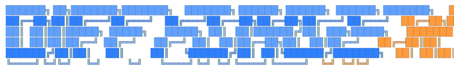
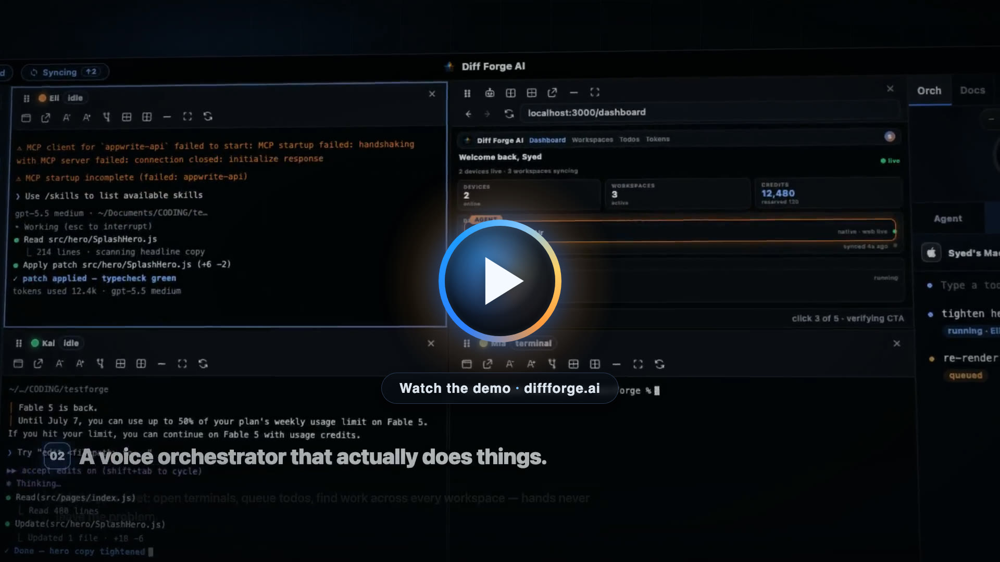

<div align="center">

# بِسْمِ اللَّهِ الرَّحْمَٰنِ الرَّحِيمِ

*In the Name of God, the Most Beneficent, the Most Merciful*

<br/>



### ⚒️ **The Paragon of ADEs** — Agentic Development Environments

*Where AI agents, voice, screenshots, assets, loops, and your entire dev workflow are forged into one native desktop app.*

       [](https://play.google.com/store/apps/details?id=ai.diffforge.twa)

<br/>

[](https://www.diffforge.ai)

*The forge at work — agents, voice, snips, loops, and the grid. **[See it live at diffforge.ai →](https://www.diffforge.ai)***

</div>

---

## What is Diff Forge AI?

Diff Forge AI is an open source Agentic Development Environment: a native desktop app, built in Rust and Tauri, where you run coding agents (Claude Code, Codex, and OpenCode) across a grid of terminals and direct them from one place.

An IDE is built around one person typing. An ADE is built around one person running a lot of agents at once, so everything here is organized around that. You get parallel agent terminals, a local kernel that keeps track of what each agent is working on, screenshots and voice you can drop straight into a prompt, automation loops, and session history you can pick back up with a single click.

The client is free and open source. There is an optional paid cloud layer on top (see [Cloud](#cloud-paid)) that lets you reach and control those same agents from the web or over the phone.

## The toolset

**Agents and terminals.** Run many coding agents at once. Claude Code, Codex, and OpenCode each get proper terminals (plain shells too) in a native grid with tabs, a big single-pane view, and breakout windows. Pick the model, reasoning effort, and speed per launch, set per-workspace defaults, and change them mid-session. A local coordination kernel (over MCP) hands each agent its task context and checkpoints, with optional isolated worktrees and automatic patch validation so parallel agents don't stomp each other. Multi-account profiles switch identities per terminal, and parked agents wake themselves back up when the work they were waiting on merges.

**Loopspaces.** A node-graph builder for automation: dispatch todos to agents, run scripts, send messages, read and write docs and assets, all wired together on a canvas. Loops fire from a button, a cron schedule, or a webhook, and run on a durable runtime with a live timeline and checkpoint/resume.

**Swarm.** Spin up a group of agents (Codex, Claude Code, OpenCode) inside a single pane, each with its own status and activity feed. Plan and Implement modes scout, fan out, and synthesize, and the results land back in your todos.

**Snipping.** Global-hotkey full screenshots, area snips, and area recordings on a frozen, multi-display, DPI-correct overlay. It hides your desktop icons during capture (real ScreenCaptureKit window exclusion on macOS, no flicker) and puts them back after. Snips stack as draggable previews you can reorder and drop straight into a prompt, thread, or todo, and there's a full annotation editor with arrows, boxes, text, and crop. It works over other apps' fullscreen windows too.

**Voice and dictation.** Push-to-talk dictation anywhere from a bottom-bar widget with a live waveform and transcript. Three engines: local Whisper (offline), cloud Deepgram, and a Diff Forge Cloud fast path on warm sockets. There's also a separate GPT-Realtime voice agent that can drive the app hands-free through the same remote-control registry the dashboard uses. Dictation can borrow the mic from a live voice session and hand it back when it's done.

**Beyond code.** The panel system isn't only terminals:
- A video editor with a media bin, multi-track timeline, word-level transcript editing, captions, AI media generation (text-to-video, image-to-video, edit, upscale), and ffmpeg export.
- A PCB workbench where boards are tscircuit `.board.tsx` files, with live schematic, PCB, 3D, simulation, and BOM tabs, and a 2D/3D element picker that drops the exact component into an agent's context.
- Native web panels: child webviews as workspace panes, with a page element picker that sends whatever you select straight to an agent.

**The plumbing.** The parts that make it usable day to day:
- A local-first asset vault per workspace, plus account-level assets, with bring-your-own-bucket support for S3, Cloudflare R2, and Backblaze B2 (your credentials stay server-side).
- Server-authoritative todos that sync across devices, a Rust dispatch brain that routes each one to the right agent, and threads and plans that carry full snip and asset context.
- Real-time credit and usage metering across every agent account and provider, backed by a local SQLite ledger.
- Native notifications for approvals, agent questions, failures, and all-work-done, tuned to ping you once at the right level and stay quiet when you're already watching.
- A menu-bar / tray mode that collapses the whole app into a popover (it works over fullscreen apps on macOS), open-at-login, and a global activity-overlay hotkey.
- A workspace MCP gateway that mounts any MCP server into every agent terminal, plus account docs, local scripts with one-click buttons, and a pop-out tools window.

## Cloud (paid)

The client does everything above on its own. The optional subscription adds the cloud services that let you leave your desk:

- **Remote control** — talk to your agents from the web dashboard, through a chat UI or a direct terminal shell over websockets.
- **Cellular** — call your agents. A voice orchestrator answers and a Cloud PBX (built on Twilio) routes the call. I use this to prompt while I'm out and about.
- **Notifications** — web push to your phone when an agent finishes or needs your input, no desktop required.
- **Cloud Loopspaces** — run the same cron, webhook, and manual loops server-side and watch them from anywhere.

Presence, cross-device sync, and the remote-control registry are what tie the desktop and the cloud together, so what you see on your phone is the same state as the app in front of you. AI Email, for inbound and outbound customer management, is in progress.

## How it's built

```text
┌────────────────────────────────────────────────────────────────────┐
│  🖥️  Diff Forge AI (this repo)                                     │
│                                                                    │
│   React WebViews ──────────── Tauri IPC ──────────── Rust Core     │
│   (app shell, snipping        (commands,             (terminals,   │
│    overlays, widgets,          events)                capture,     │
│    tray popover)                                      audio, sync, │
│                                                       coordination)│
└───────────────────────────────┬────────────────────────────────────┘
                                │  WebSockets / HTTPS
                    ┌───────────▼────────────┐
                    │ ☁️  Diff Forge Cloud   │
                    │  presence · todo sync  │
                    │  loops · tokenomics    │
                    │  assets · web push     │
                    │  remote controls       │
                    └────────────────────────┘
```

There are three codebases behind Diff Forge AI:

- **This repo** is the native client — a Rust + Tauri core (terminals, capture, audio, sync, coordination) behind React webviews for the app shell, overlays, widgets, and tray.
- **next-diffforge** is the web dashboard, built in Next.js.
- **cloud-diffforge** is the cloud: Rust websocket services, SQLite, and S3-compatible storage.

It stands on a lot of good open source. The PCB panel is [tscircuit](https://github.com/tscircuit/tscircuit), terminals render with [xterm.js](https://github.com/xtermjs/xterm.js), dictation is inserted with [enigo](https://github.com/enigo-rs/enigo), and capture uses [scap](https://github.com/CapSoftware/scap) and xcap. Agents talk to everything over the Model Context Protocol.

| Layer | Tech |
|---|---|
| Native core | Rust, Tauri v2, ScreenCaptureKit / CoreGraphics / Win32 / PipeWire, xcap + scap, whisper |
| UI | React 19, styled-components, Vite (code-split per window) |
| Agent protocol | Model Context Protocol (MCP) — local kernel + workspace gateway + app-control bridge |
| Cloud | Rust websocket services, SQLite, S3-compatible object storage |

## Development

```bash
npm install
npm run dev     # native Tauri window + Vite hot reload in the WebView
npm run build   # production bundles
```

`npm run dev` launches the native Tauri window and uses Vite hot reloading inside the JavaScript WebView. `npm run build` and `npm run package` create the Windows NSIS installer locally under `src-tauri/target/release/bundle/nsis/`; release CI builds and publishes macOS, Windows, and Linux bundles (with `latest.json` + SHA256SUMS) as GitHub releases on this repo.

During development, Vite runs on `127.0.0.1` as a private hot-reload feed for the native WebView. That URL is not the product surface and is not used by packaged builds.

### Auth & Cloud

Desktop login opens `https://diffforge.ai/desktop/login` in the system browser, receives a `diffforge://auth/callback` deep link (`diffforge-dev://` in dev builds), exchanges the one-time code with `https://diffforge.ai/api/desktop/sessions/exchange`, and validates stored desktop sessions on app launch. The Diff Forge CLI shares the same desktop auth state. In local-cloud development, the login and API base resolve to local `next-diffforge` when `RUST_DIFFFORGE_ALLOW_LOCAL_CLOUD_MCP=1`, or explicitly through `RUST_DIFFFORGE_WEB_LOGIN_URL` and `RUST_DIFFFORGE_API_BASE_URL`.

Cloud MCP traffic is pinned to `https://balancer.diffforge.ai`. Cloud MCP URL overrides are ignored unless `RUST_DIFFFORGE_ALLOW_LOCAL_CLOUD_MCP=1` is set for development. After desktop login, the app keeps the desktop session token locally and exchanges it through `next-diffforge` for short-lived Appwrite JWTs before opening balancer websockets or syncing coordination events.

## License

Licensed under the **[Kingdom of Abraham Permissive License (KOA-P-1.0)](LICENSE.md)** — an MIT-equivalent license for the AI Agents Era. Every copy must carry the license in full. See the [Kingdom Of Abraham Licenses](https://github.com/Rizzist/Kingdom-Of-Abraham-Licenses) collection.

---

<div align="center">

**Diff Forge AI** — an open source ADE, mostly written by the agents it runs.

</div>
